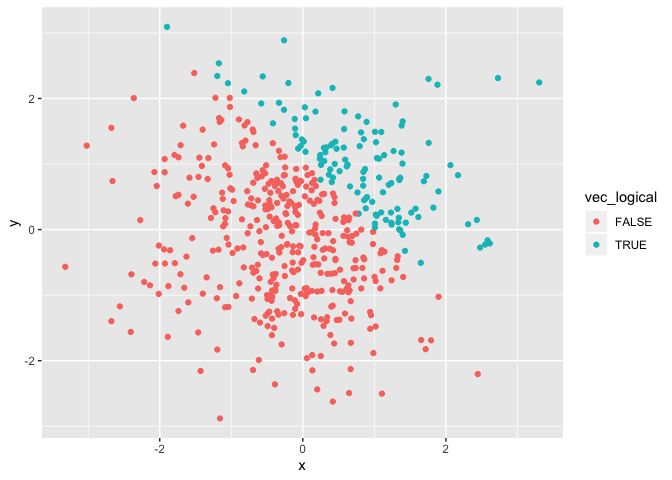
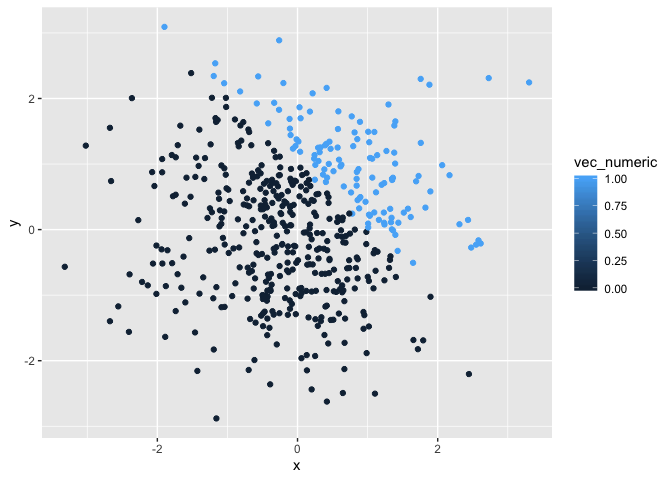
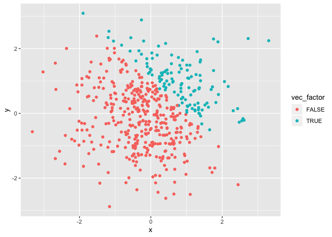

p8105\_HW1\_mk4208
================

Loading
    packages

``` r
library(tidyverse)
```

    ## ── Attaching packages ───────────────────────────────────────────────────────────────────── tidyverse 1.2.1 ──

    ## ✔ ggplot2 3.2.1     ✔ purrr   0.3.2
    ## ✔ tibble  2.1.3     ✔ dplyr   0.8.3
    ## ✔ tidyr   0.8.3     ✔ stringr 1.4.0
    ## ✔ readr   1.3.1     ✔ forcats 0.4.0

    ## ── Conflicts ──────────────────────────────────────────────────────────────────────── tidyverse_conflicts() ──
    ## ✖ dplyr::filter() masks stats::filter()
    ## ✖ dplyr::lag()    masks stats::lag()

Problem 1

``` r
# Creating a data frame

set.seed(100)
df = tibble(
  random = rnorm(8),
  vec_logical = random > 0,
  vec_char = c("a", "b", "c", "e", "f", "g", "h", "i"),
  vec_factor = factor(c("M", "F", "X", "M", "F", "X", "M", "F"))
)

# Taking the mean of each variable in the dataframe 
mean(pull(df, random)) # WORKS 
```

    ## [1] 0.1256937

``` r
mean(pull(df, vec_logical)) # WORKS
```

    ## [1] 0.625

``` r
mean(pull(df, vec_char)) # Does not work
```

    ## Warning in mean.default(pull(df, vec_char)): argument is not numeric or
    ## logical: returning NA

    ## [1] NA

``` r
mean(pull(df, vec_factor)) # Does not work
```

    ## Warning in mean.default(pull(df, vec_factor)): argument is not numeric or
    ## logical: returning NA

    ## [1] NA

``` r
# Writing a code chunk that applies as.numeric function to the logical, character, and factor variables 

mean(as.numeric(pull(df, vec_logical)))
```

    ## [1] 0.625

``` r
mean(as.numeric(pull(df, vec_char)))
```

    ## Warning in mean(as.numeric(pull(df, vec_char))): NAs introduced by coercion

    ## [1] NA

``` r
mean(as.numeric(pull(df, vec_factor)))
```

    ## [1] 1.875

``` r
# Converting the logical vector to numeric and multiplying the random sample by the result 

as.numeric(pull(df, vec_logical)) * pull(df, random)
```

    ## [1] 0.0000000 0.1315312 0.0000000 0.8867848 0.1169713 0.3186301 0.0000000
    ## [8] 0.7145327

``` r
# Converting the logical vector to a factor and multiplying the random sample by the result 

as.factor(pull(df, vec_logical)) * pull(df, random)
```

    ## Warning in Ops.factor(as.factor(pull(df, vec_logical)), pull(df, random)):
    ## '*' not meaningful for factors

    ## [1] NA NA NA NA NA NA NA NA

``` r
# Converting the logical vector to a factor and then converting the result to numberic and multiplying the random sample by the result 

as.numeric(as.factor(pull(df, vec_logical))) * pull(df, random)
```

    ## [1] -0.50219235  0.26306233 -0.07891709  1.77356962  0.23394254  0.63726018
    ## [7] -0.58179068  1.42906542

Problem 2

``` r
# Creating a data frame 
df2 = tibble(
  x = rnorm(500),
  y = rnorm(500),
  vec_logical = x + y > 1,
  vec_numeric = as.numeric(vec_logical),
  vec_factor = as.factor(vec_logical)
)
```

Here is a short description of the dataframe created: This dataframe has
500 rows and 5 columns. The mean, median and standard deviation of ‘x’
variable is -0.0406178, -0.0656534, and 1.0151934 respectively. The
proportion of cases with x + y \> 1 is -0.0406178

``` r
# Creating a scatter plot of  y vs x 
plot1 = ggplot(df2, aes(x=x, y=y, color=vec_logical)) + 
  geom_point()

print(plot1)
```

<!-- -->

``` r
plot2 = ggplot(df2, aes(x=x, y=y, color=vec_numeric)) + 
  geom_point()

print(plot2)
```

<!-- -->

``` r
plot3 = ggplot(df2, aes(x=x, y=y, color=vec_factor)) + 
  geom_point()

print(plot3)
```

<!-- -->
